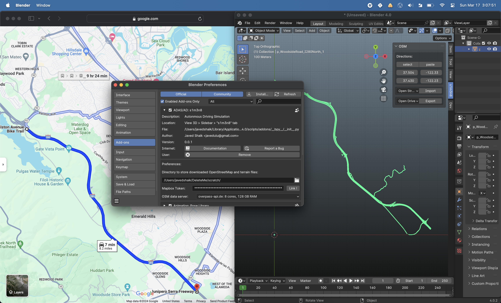

# Autonomous Driving Scene in Blender 

Autonomous Driving Scene Editor addon for blender 

## Features

**Open Street Maps**
* Route directions on maps.google.com
* Automatic Openstreet Map download for Route
* Openstreet Map Ways Editing - [*To Be Done*]
* Terrain from SRTM Data - [*To Be Done*]

**Scene**

* Open Drive 1.7 Export form Open Street Map - [*To Be Done*]
* AutoDesk FBX / Pixar USDZ export (Blender) - [*To Be Done*]

### Requirements 
- Blender Dev Branch (universal scene description) [USD](https://builder.blender.org/download/experimental/)

### Platforms
* Mac OS X  [14.3 Sonoma](https://www.apple.com/macos/sonoma/) - Apple Silicon
* Linux  (Coming soon ..)
* ~~Windows~~ - *NOT SUPPORTED*

## Credits

Credits for the projects which inspired me 
- [Blender VS Code extension](https://github.com/JacquesLucke/blender_vscode)
- [Blosm (Blender addon for OpenStreet Map)](https://github.com/vvoovv/blosm#blender-osm-openstreetmap-and-terrain-for-blender)
- [Blender Driving Scenario Creator add-on](https://github.com/johschmitz/blender-driving-scenario-creator)
